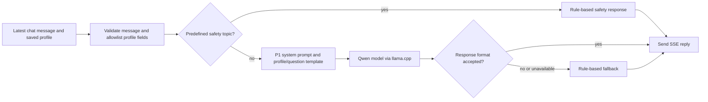
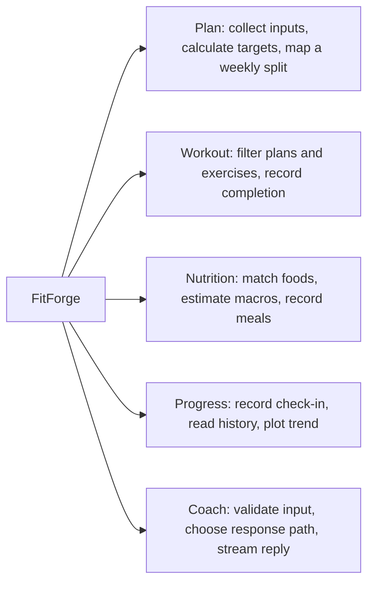
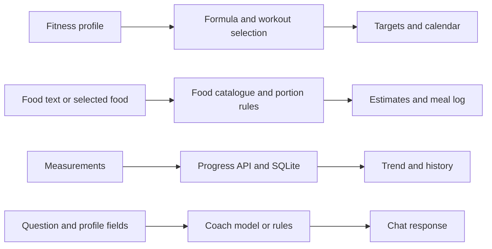
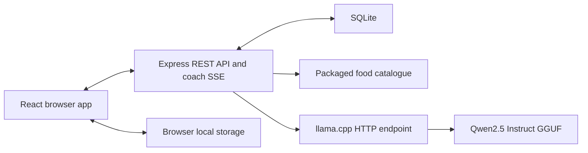

# FitForge design diagrams

## Prompt workflow

```mermaid
flowchart LR
  A[Latest chat message and saved profile] --> B[Validate message and allowlist profile fields]
  B --> C{Predefined safety topic?}
  C -- yes --> D[Rule-based safety response]
  C -- no --> E[P1 system prompt and profile/question template]
  E --> F[Qwen model via llama.cpp]
  F --> G{Response format accepted?}
  G -- yes --> H[Send SSE reply]
  G -- no or unavailable --> I[Rule-based fallback]
  D --> H
  I --> H
```

## Task decomposition

```mermaid
flowchart LR
  A[FitForge] --> B[Plan: collect inputs, calculate targets, map a weekly split]
  A --> C[Workout: filter plans and exercises, record completion]
  A --> D[Nutrition: match foods, estimate macros, record meals]
  A --> E[Progress: record check-in, read history, plot trend]
  A --> F[Coach: validate input, choose response path, stream reply]
```

## Input and output flow

```mermaid
flowchart LR
  A[Fitness profile] --> B[Formula and workout selection] --> C[Targets and calendar]
  D[Food text or selected food] --> E[Food catalogue and portion rules] --> F[Estimates and meal log]
  G[Measurements] --> H[Progress API and SQLite] --> I[Trend and history]
  J[Question and profile fields] --> K[Coach model or rules] --> L[Chat response]
```

## System architecture

```mermaid
flowchart LR
  A[React browser app] <--> B[Express REST API and coach SSE]
  A <--> C[Browser local storage]
  B <--> D[SQLite]
  B --> E[Packaged food catalogue]
  B --> F[llama.cpp HTTP endpoint]
  F --> G[Qwen2.5 Instruct GGUF]
```
